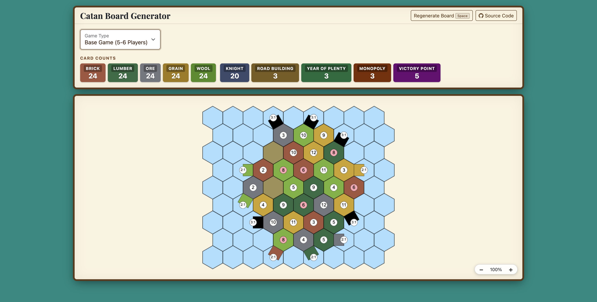

# Catan Board Generator

A static web app that generates randomized Catan board layouts. No install, no build step — just open `src/index.html` in a browser.



## Features

- **Randomized boards** for both Base Game (3–4 players) and Base Game (5–6 players)
- **Harbor placement** is also randomized, with correct edge orientations
- **Balance scoring** — each board is graded on 6 metrics (resource distribution, clustering, probability spread, harbor placement) so you can keep regenerating until you get a well-balanced layout
- **Resource probability** — see the actual roll probability for each resource type
- **Card count reference** — colored tiles show resource and development card counts at a glance
- **Zoom controls** to zoom in/out without regenerating the board
- **Keyboard shortcut** — press `Space` to regenerate
- **Mobile friendly** — tap the board to regenerate; settings panel collapses to save screen space

## Usage

Open `src/index.html` directly in any modern browser. No server or dependencies required.

1. Select a game type from the dropdown
2. A randomized board is generated automatically
3. Press **Regenerate Board**, hit `Space`, or tap the board to generate a new layout

## Project Structure

```
src/
  index.html   # UI layout (Bootstrap 5)
  main.js      # All game logic and canvas rendering
  main.css     # Parchment/wood theme
  favicon.png
```

## Development

No build tools are needed. Edit the files directly and refresh the browser.

For details on the hex grid geometry, see [docs/hex-math.md](docs/hex-math.md).
